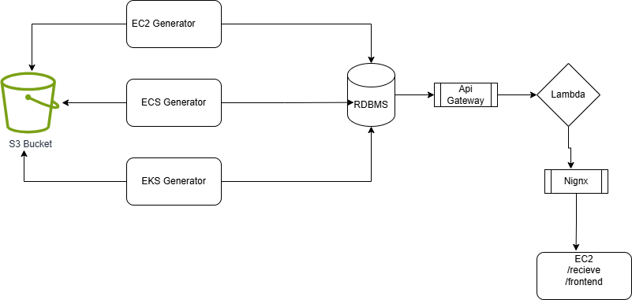

# Generator- Multiple Resources, One Reciever
Multiple resources include ECS/EKS/EC2


To build the infra
-  run ```terraform apply``` in terraform/
- For more info about the Terraform module, head to [./terraform/terraform.md](./terraform/terraform.md)

to build the pipeline
- push repository with your changes to trigger the build after that
- entry point for this is [./azure-pipelines.yml](./azure-pipelines.yml)


to access the application https://<ip>:8080/


**********everytime need to update credentials manually in azure devops and local**********


**- need to paste pem file in library manually (only once if you are redeploying infrastructure through terafform)
- update ip and gateway url in the .env folder**
- update credentials in local/azuredevops


TODO
- ADD a nginx so we can move to https:// -done
- ECS-lambda - done
- add a skip build feautre - partially done (commented it)
- EKS-lambda - done without extending pods (needs a heavier built, will try after database)
- add a database- done
- create a script to update aws creds locally and in azure devops (this is annoying and helps a lot)- done but did not keep it in this repo.
- put resources on sleep instead of destroying them.
- add s3 as files saving, with a locaiton pointer in db instead of all the data in db--done


- see if you can add how many threads/connection pools/cores/tasks are running to the UI.
- add a loadbalancer and set number of limits on one container/instance
- replace javascript with python
- explore bedrock/cloundfront/kafka


- issue- need to update creds everytime because we need creds to access s3 from our resources.


withour concurrency.
10000 records - 19 sec
10000 records - 400ms with UNNEST


- DATABASE- use UNNEST for processing group records (massive upgrade)